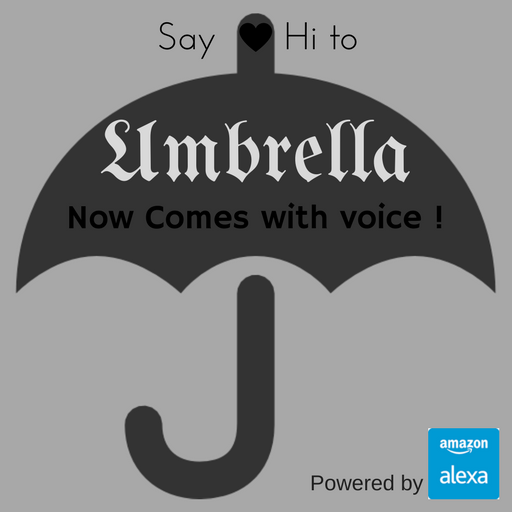

# We are Live [Download](https://www.amazon.com/dp/B071HD19T5/ref=lp_14284889011_1_3?s=digital-skills&ie=UTF8&qid=1494014648&sr=1-3) From here

## Small Description
A simple skill to tell you to carry umbrella or not based on your city's weather today.

## Background
People living in London, Mumbai and other cities around the world will relate to the problem of unexpected rains. This amazon skill lets the user whether or not it will rain or no today and whether they need to carry their umbrella or not. The information given by app gives you the status according to next 3 hour weather information.
You can update your current location independently. No need to include you location everytime while asking as your location is update with each query.

With this skill added to amazon alexa I want to bring life to the lifeless useful things (eg Umbrella here ) around us so that people can communicate with lifeless things too and increase their productivity.

If this skill succeeds, similar apps for other daily life stuff like medicines, overcoat etc would follow.

